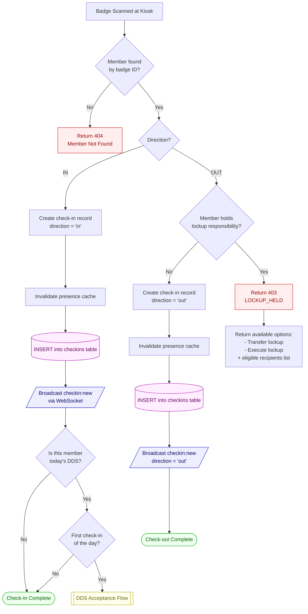
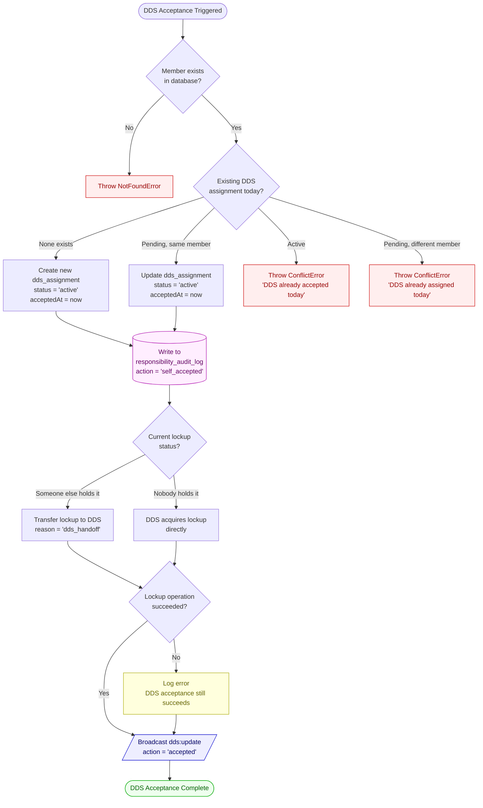
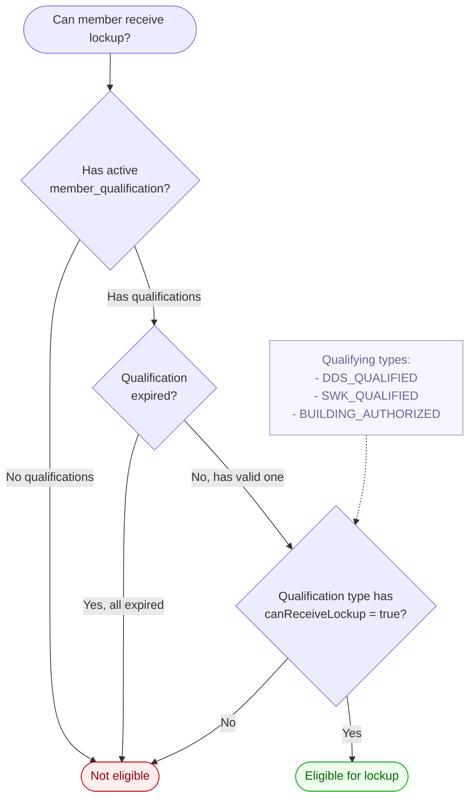
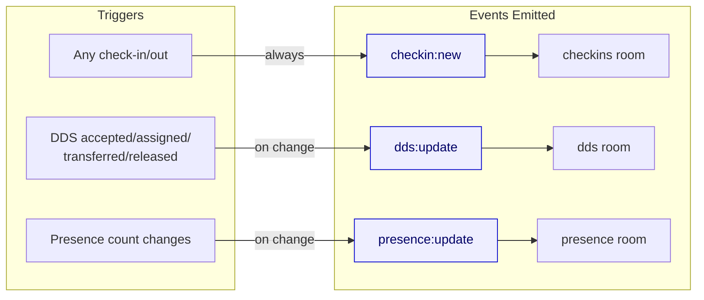

# Scan System Flowchart

## Main Scan Flow



## DDS Acceptance Flow



## DDS Determination Flow

```mermaid
flowchart TD
    START([Who is today's DDS?]) --> CHECK_TABLE{Check dds_assignments\nfor today's date\nstatus = pending | active}

    CHECK_TABLE -->|Found| RETURN_ASSIGNMENT([Return DDS assignment])

    CHECK_TABLE -->|Not found| FALLBACK[Fall back to\nweekly schedule]

    FALLBACK --> OP_DATE[Calculate operational date\n3 AM cutoff:\n00:00-02:59 = previous day]
    OP_DATE --> OP_WEEK[Get Monday of\noperational week]
    OP_WEEK --> FIND_ROLE{Find duty role\nwhere code = 'DDS'}

    FIND_ROLE -->|Not found| NO_DDS([No DDS today])
    FIND_ROLE -->|Found| FIND_SCHEDULE{Find weekly_schedule\nfor this role + week}

    FIND_SCHEDULE -->|Not found| NO_DDS
    FIND_SCHEDULE -->|Found| HAS_ASSIGNMENT{Has non-released\nassignment?}

    HAS_ASSIGNMENT -->|No| NO_DDS
    HAS_ASSIGNMENT -->|Yes| RETURN_SCHEDULE([Return schedule-based DDS])

    %% ─── STYLES ───
    classDef success fill:#efe,stroke:#0a0,color:#060
    classDef none fill:#f5f5f5,stroke:#999,color:#666

    class RETURN_ASSIGNMENT,RETURN_SCHEDULE success
    class NO_DDS none
```

## Lockup Eligibility Check



## WebSocket Events Summary


