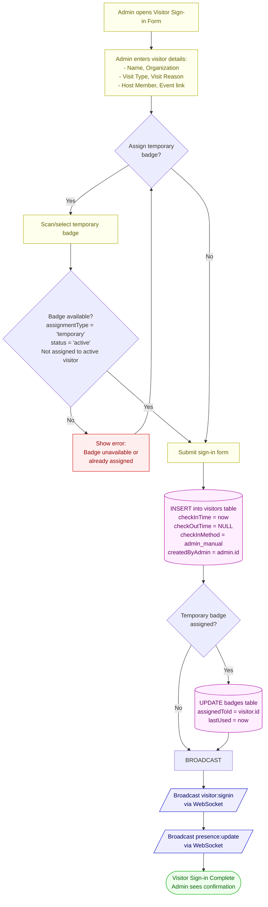
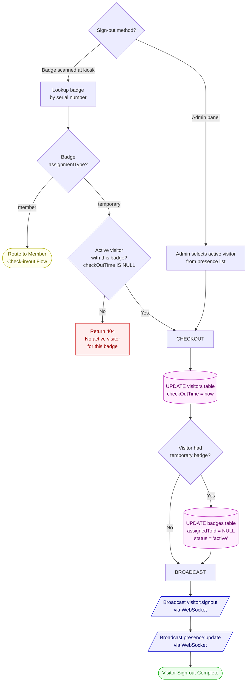
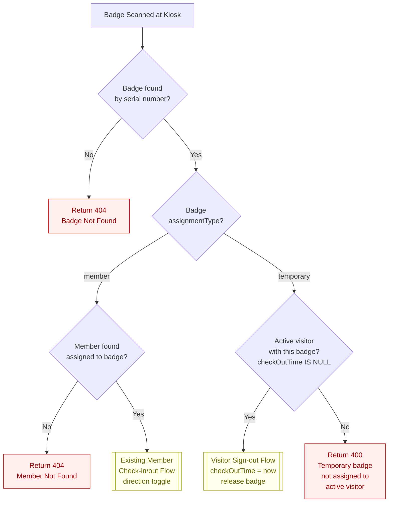
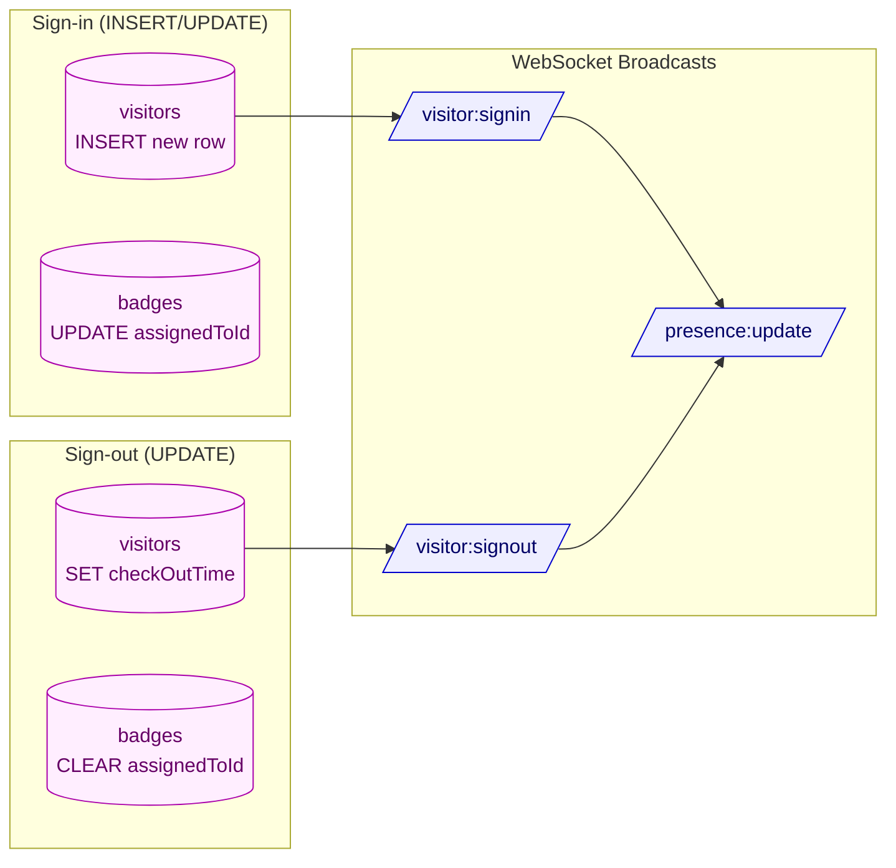
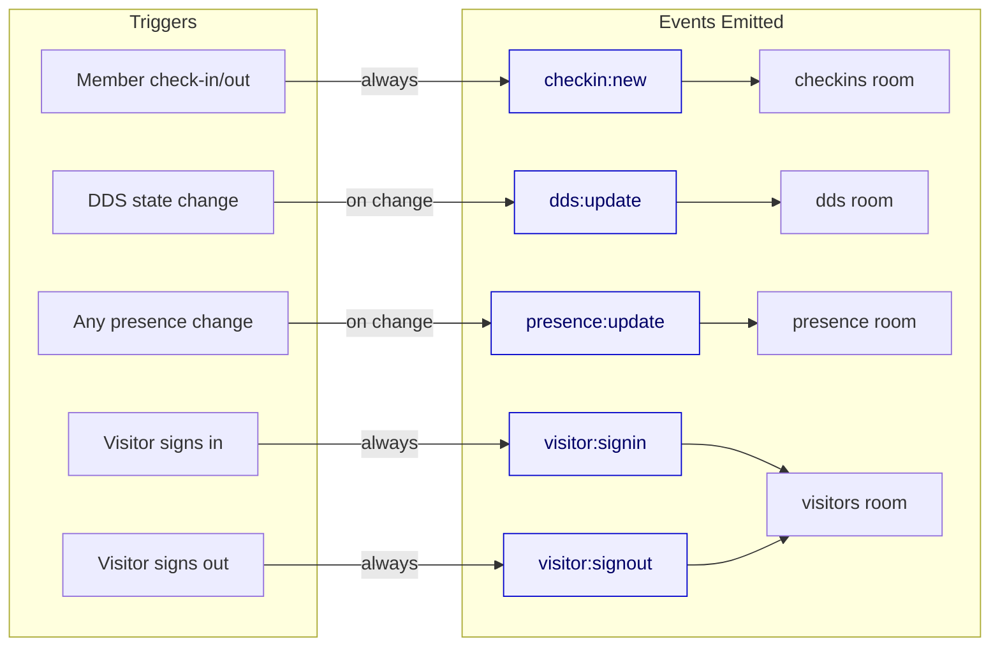

# Visitor Sign-in System Flowchart

## Visitor Sign-in Flow (Admin Panel)

## Visitor Sign-out Flow

## Updated Main Scan Flow (Badge Scan Router)

This replaces the top of the existing scan flowchart to handle both member and visitor badges.

## Tables Updated Summary

## WebSocket Events Summary (Updated)

